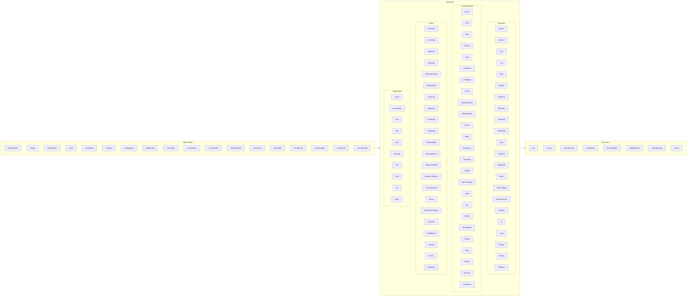

# Library ReactiveArduino

ReactiveArduino implements observable-observer pattern on a processor like Arduino. The purpose is to provide declarative programming approach, within the capacity constraints of a low-power MCU.

ReactiveArduino is heavily based on [ReactiveX](http://reactivex.io/) and [ReactiveUI](https://reactiveui.net/), adapted to the needs and limitations in a MCU.

## Instructions for use
The general use of ReactiveArduino consists of:
* Define an observable (Timer, Interval, FromArray, FromProperty...)
* Chain with one or more operators (Distinct, Where, Select, First, Last, Sum...) 
* Subscribe an observer (Do, DoFinally, ToProperty, ToArray...)

For example:
```c++
	FromRange(10, 20)
	.Select([](int x) { return x + 10; })
	.Do( [](int x) { Serial.println(x); });
```

More examples in Wiki/[Examples](https://github.com/luisllamasbinaburo/Arduino-ReactiveArduino/wiki/Examples)


### Observable, observers and operators legend
More info about the Observables, Observers, and Operators available in the [Wiki](https://github.com/luisllamasbinaburo/Arduino-ReactiveArduino/wiki)



### Creating Observables
Observables are generally generated through factory methods provided by the Reactive class.
For example:
```c++
FromArray<int>(values, valuesLength)
```

### Chaining operators and observers
Chaining operators are usually make using 'Fluent Notation' which allows to combine observable and observers.
For example:
```c++
observableInt.ToSerial();
```

To chain existing operators ReactiveArduino uses overload of operator `>>`.
For example:
```c++
observableInt >> ToSerial<bool>();
```

### Cool and hot observables
ReactiveArduino has two types of observables, hot and cold.
Hot observables emits the sequence when an observer subscribes to it. For example, `FromArray(...)` is a Hot Observable.
```c++
FromArray(values, valuesLength)
```
Cold observable does not emits any item when a observer subscribes to it. You have to explicitly call the `Next()` method whenever you want. For example, `FromArrayDefer(...)` or `ManualDefer(...)`.
```c++
FromArrayDefer(values, valuesLength)
```

With `ManualDefer(...)` you also have to explicitly call `Next()` to emit, and `Complete()` to finish the sequence.
```c++
auto obs = ManualDefer<int>();
obs >> ToSerial<int>();
// ...later in code
obs.Next();
obs.Complete();
```
### Dynamic memory considerations
On many occasions we generate operators directly when we chain them, for example in the `Setup()`. However, creating an operator allocates dynamic memory. Therefore, you should avoid creating them in `Loop()`, or you could run out of memory.
If you need to reuse (typically, call some operator method later in your code) set it as a global variable, and chain as normal.
```c++
auto counter = Count<int>();
...
//(later in code)
...
obsString >> counter >> ToSerial<String>();
```

## Examples
This example show how to use Reactive Operator to perform a 3-elements Median filter, then a 4-elements Moving Average Filter, and make some action with the final filtered value.
```c++
#include "ReactiveArduinoLib.h"
using namespace Reactive;


int values[] = { 0, 1, 4, 6, 2, 5, 7, 3, 5, 8 };
int valuesLength = sizeof(values) / sizeof(values[0]);

void setup()
{
	Serial.begin(9600);
	while (!Serial) delay(1);

	FromArray(values, valuesLength)
	.Cast<float>()
	.Median5()
	.MovingAverage(4)
	.DoAndFinally(
		[](float x) { Serial.println(x); },
		[]() { Serial.println("No more items"); }
	);
}

void loop()
{
	delay(2000);
}
```

More examples in Wiki/[Examples](https://github.com/luisllamasbinaburo/Arduino-ReactiveArduino/wiki/Examples)
